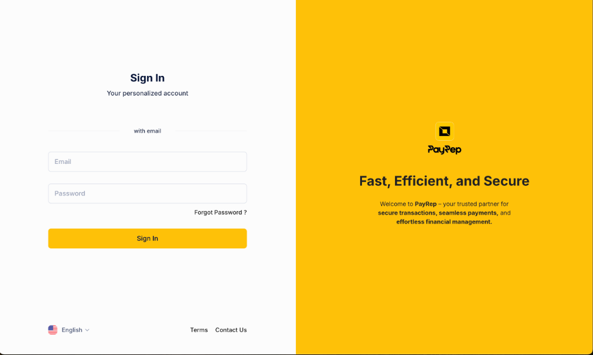
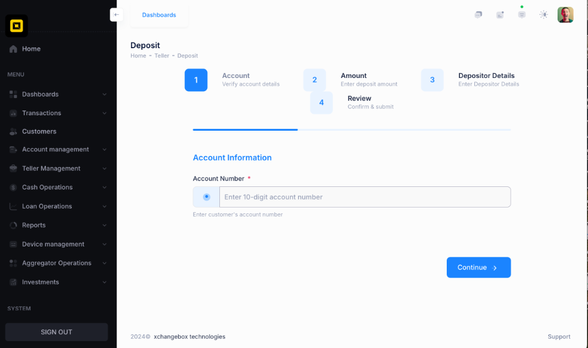
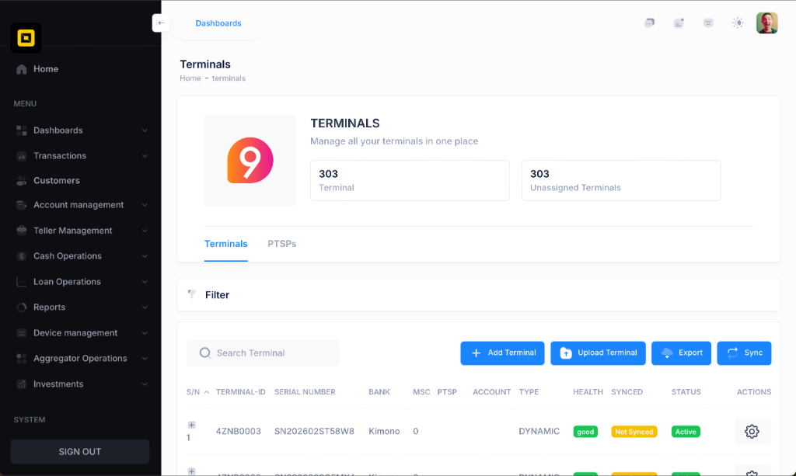
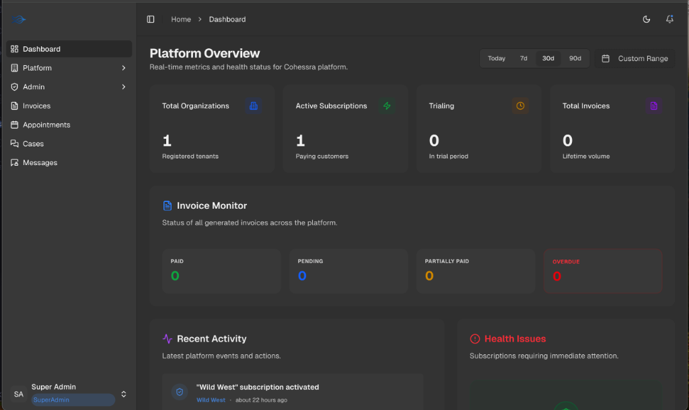
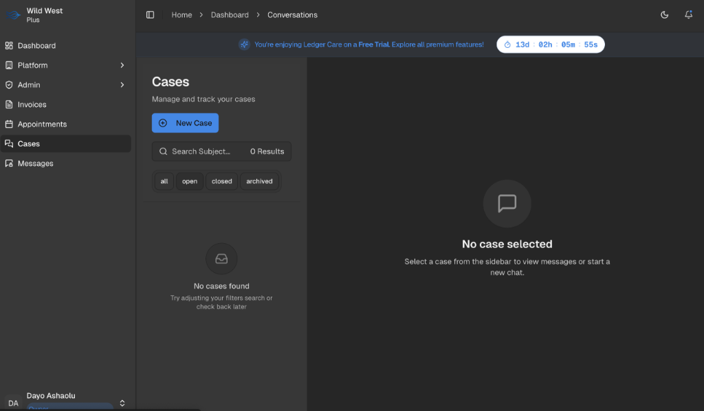
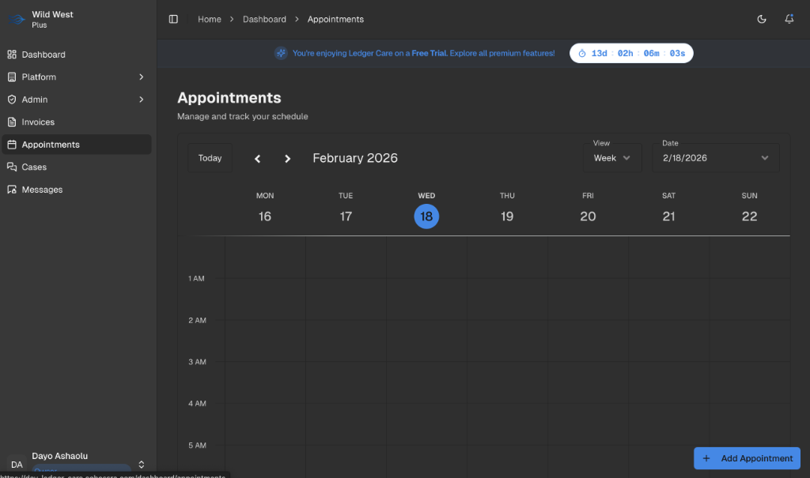
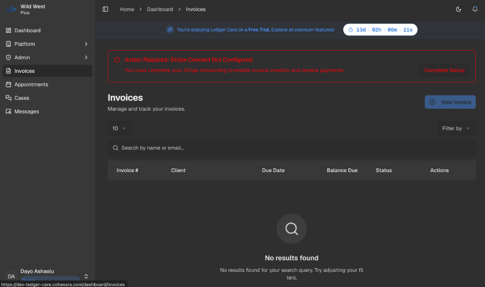

# Hi there, I'm Oluwatoba 👋

I'm a passionate **Software Engineer** specializing in building scalable backend systems, secure enterprise platforms, and cloud-native infrastructure. I have extensive experience with **Python (Django)**, **TypeScript (NestJS)**, and **Terraform**, architecting robust applications that adhere to strict security and compliance standards.

---

## 🛠️ Tech Stack

*   **Languages:** Python, TypeScript, JavaScript, HCL (Terraform)
*   **Frameworks:** Django, Django REST Framework, NestJS, Express
*   **Databases:** PostgreSQL, Redis
*   **Cloud & DevOps:** AWS (ECS, RDS, S3, WAF, KMS), Docker, Terraform, Celery
*   **Security & Compliance:** AWS CloudTrail, Config, Secrets Manager, OAuth2, RBAC

---

## 🚀 Featured Projects

> _These are just a few highlights from my extensive portfolio. I've selected them to demonstrate my expertise in building high-scale financial and enterprise systems._

### 🥷 Core banking platform
> **Live Demo:** [dev.payrepmfb.com](https://dev.payrepmfb.com)

A high-performance financial backend system designed to power modern digital banking and exchange services.

  
  
  

*   **Tech Stack:** Python, Django REST Framework, Celery, Redis, PostgreSQL.
*   **Key Features:**
    *   **Transaction Processing:** Robust engine for handling transfers, payments, and ledger management.
    *   **Compliance:** Integrated KYC/AML workflows and secure authentication.
    *   **Scalability:** Async task processing for high-volume transactions.

### 🏢 Cohessra (Enterprise SaaS Platform)
> **Live Demo:** [dev-ledger-care.cohessra.com](https://dev-ledger-care.cohessra.com)

A multi-tenant implementation management platform focused on organizational resilience and secure operations.

  
  
  
  

*   **Tech Stack:** TypeScript, NestJS, TypeORM, PostgreSQL, AWS.
*   **Infrastructure as Code (IaC):**
    *   **Terraform:** Fully automated infrastructure provisioning for Dev/Prod environments.
    *   **Security:** Implemented **AWS WAF** (Web Application Firewall) with managed rules for SQLi and bad inputs.
    *   **Data Protection:** Enforced encryption at rest using **AWS KMS** for RDS, S3, and CloudTrail logs.
    *   **Compliance:** comprehensive audit trails via **CloudTrail** and automated secret rotation using **AWS Secrets Manager**.
*   **Key Features:**
    *   **Advanced Multi-tenancy:** Strict data isolation and context-aware RBAC.
    *   **Billing Engine:** Custom subscription management with Stripe Connect.

---

## ☁️ Infrastructure & Security Expertise

I don't just write code; I design secure, compliant, and scalable infrastructure.

*   **IaC:** Modular Terraform architecture for ECS Fargate, RDS, and VPC networking.
*   **Security:** Implementation of strict security groups, private subnets, and WAF rulesets.
*   **Observability:** Centralized logging with CloudWatch and distributed tracing.

---

## 📈 Stats

---

## Connect with me

